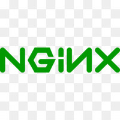
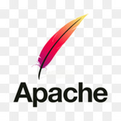
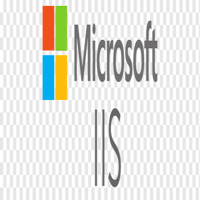
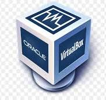

# Deliverable 1 Submission

## Basic Terminology

### What is a web server?
* **Web Server** :  A web server is a computer hosting one or more websites. "Hosting" means that all the web pages and their supporting files are available on that computer. The web server will send any web page from the website it is hosting to any user's browser, per user request.

### What is Apache?
* **Apache** : Apache web server is one of the most popular web servers developed by the Apache

### What are some example web server applications?

* Nginx - Nginx is the next open source web server after Apache.
  

* Apache - Apache web server is one of the most popular web servers developed by the Apache Software Foundation.
* 

* Microsoft IIS -  A Microsoft product, IIS is a server that offers all the features such as Apache.
  
### What is virtualization?
* Virtualization is technology that you can use to create virtual representations of servers, storage, networks, and other physical machines.
  
### What is virtualbox?
 
* It allows users to create and run virtual machines on their computers, enabling them to install and run multiple operating systems simultaneously. This is particularly useful for testing software, experimenting with different configurations, and isolating environments for increased security.

### What is a virtual machine?
* A virtual machine (VM) is a digital version of a physical computer. Virtual machine software can run programs and operating systems, store data, connect to networks, and do other computing functions, and requires maintenance such as updates and system monitoring.
  
### What is Ubuntu Server?
 

* Ubuntu Server is a version of the Ubuntu operating system designed and engineered as a backbone for the internet. Ubuntu Server brings economic and technical scalability to your data centre, public or private.

### What is a firewall?
* **Firewall** : A firewall is a network security device that monitors incoming and outgoing network traffic and decides whether to allow or block specific traffic based on a defined set of security rules.

### What is SSH?
*  The Secure Shell (SSH) protocol is a method for securely sending commands to a computer over an unsecured network. SSH uses cryptography to authenticate and encrypt connections between devices.