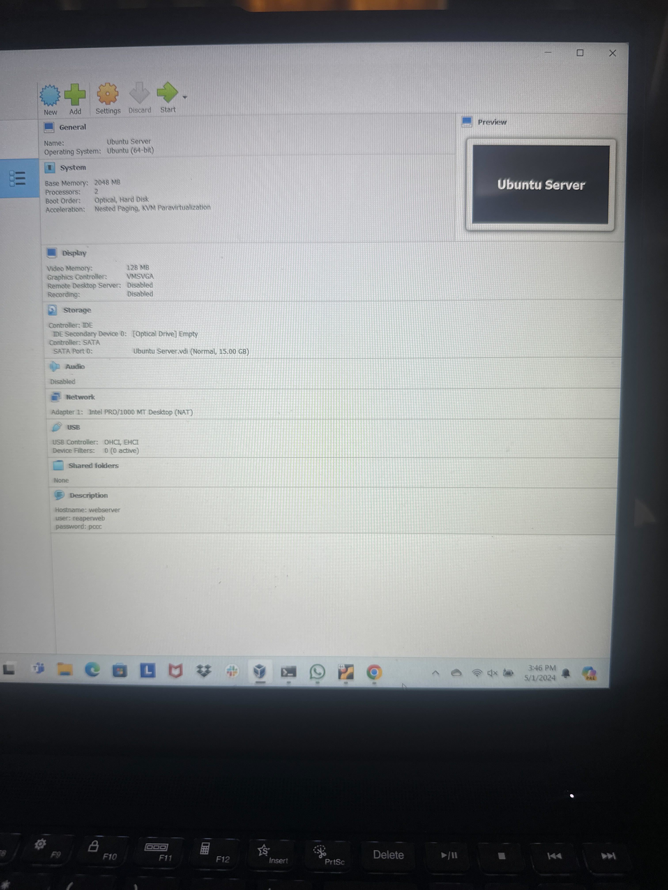
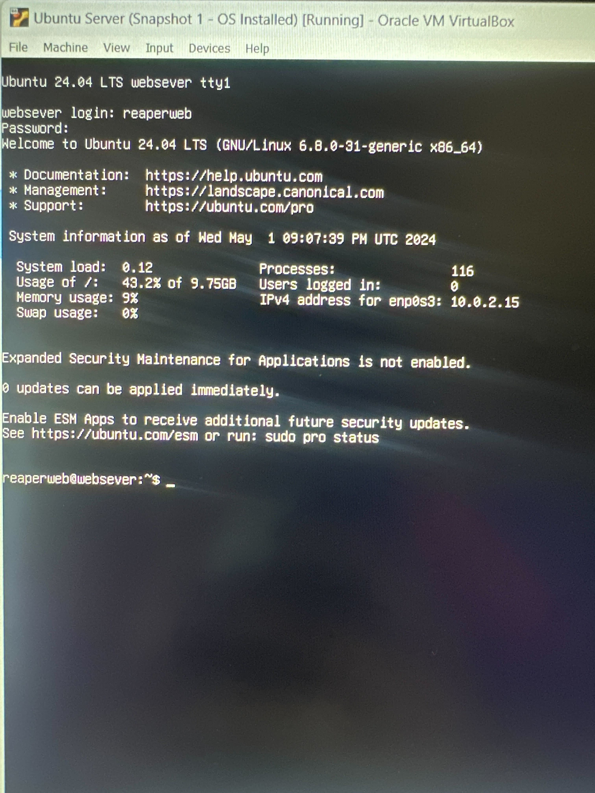

# Deliverable 2 Submission

## Server Specifications

## Ubuntu Login Screen

## Questions
3. **What is the IP address of your Ubuntu Server Virtual Machine?**
   10.0.2.15
4. **How do you enable the Ubuntu Firewall?**
   sudo ufw enable
5. **How do you check if the Ubuntu Firewall is running?**
   sudo ufw status
6. **How do you disable the Ubuntu Firewall?**
   sudo ufw disable
7. **How do you add Apache to the Firewall?** 
   sudo apt update; sudo apt upgrade-y
8. **What is the command you used to install Apache?**
   sudo apt install apache2-y
9.  **What is the command you use to check if Apache is running?**
   systemclt status apache2 --no-pager- 
10. **What is the command you use to stop Apache?**
    sudo systemctl stop apache2 ssh
11. **What is the command you use to restart Apache?**
    sudo systemctl restart apache2 ssh 
12. **What is the command used to test Apache configuration?**
    apachectl configtest
13. **What is the command used to check the installed version of Apache?**
    apt info apache2
14. **What are the most common commands to troubleshoot Apache errors? Provide a brief description of each command.**
    * systemctl - It is used to control and manage Linux services.
    * apachectl - it is use to check the Apache configuration files for any error.
15. **Which are Apache Log Files, and what are they used for? Provide examples and screenshots.**
