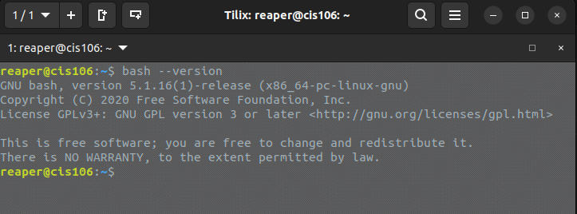
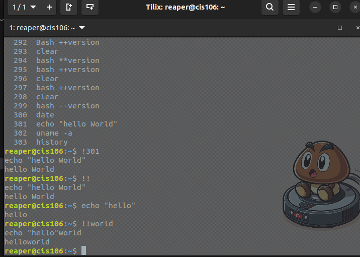
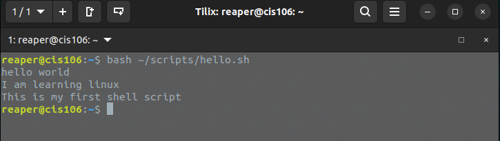
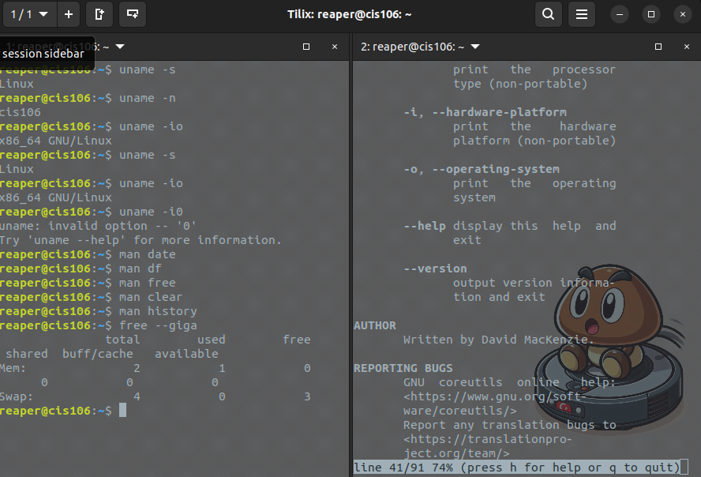
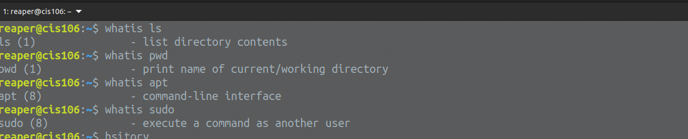
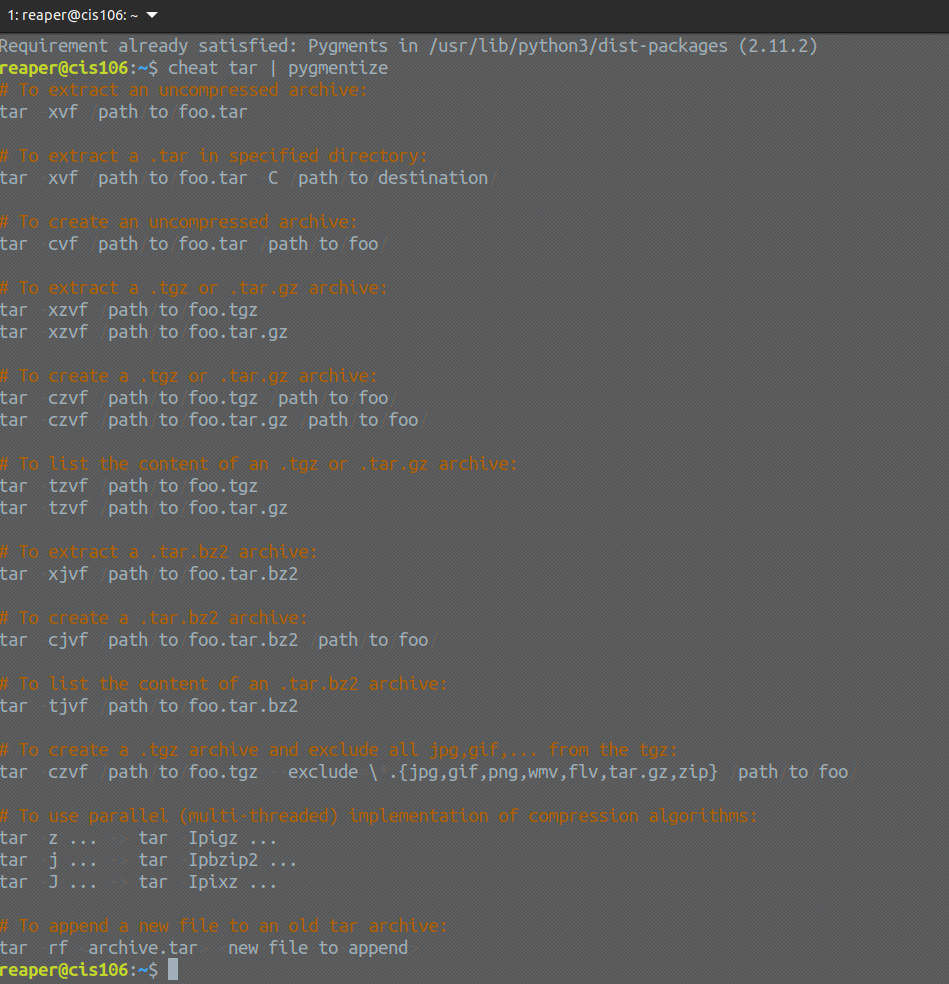
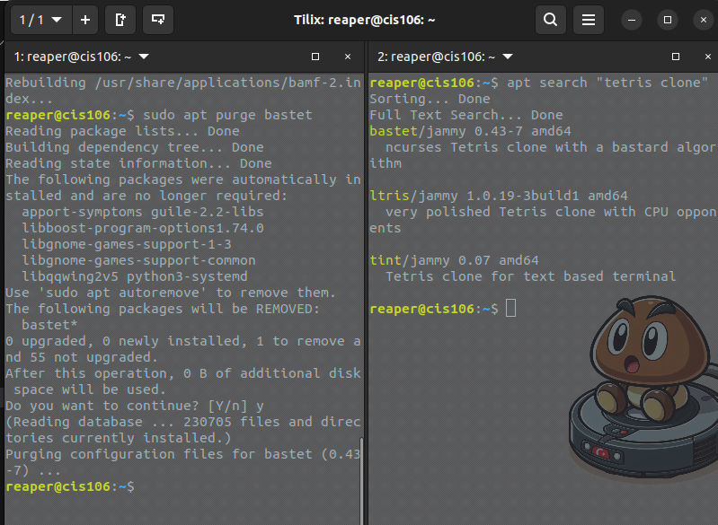
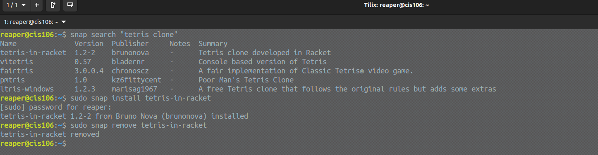

# Week Report 3 
## Completed work for week 3
+ [lab 3](../../labs/lab3/lab3.md)
+ [Notes 1](../../notes/notes1/notes1.md)

### Practice 2: Accessing the Bash Shell

### Practice 3: Using the Command history

### Practice 4: My first shell script

### Practice 5: Using man

### Practice 6: Using help

### Practice 7: Using cheat

### Practice 1: Managing software

### Practice 3: Installing and removing snaps

