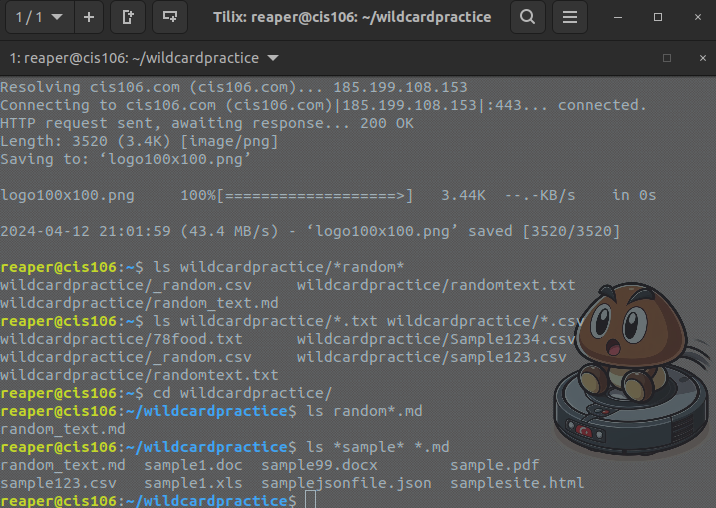
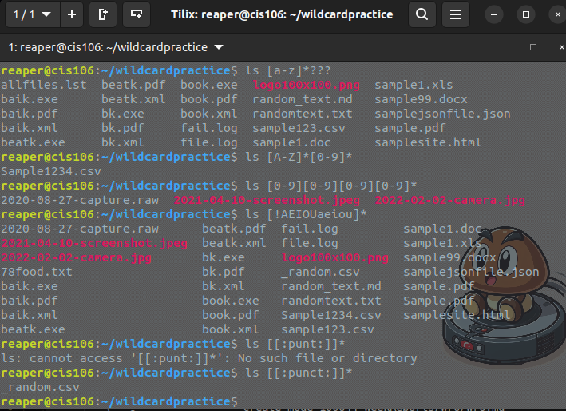

# Week Report 6## Wildcards.### * Wildcard
The * wildcard matches from 0 to any number of characters.
* Examples:
    * List all the text file in a directory
        * `ls *.txt`
    * List all the files that start with the word file.
        * `ls file*`
    * Copy all the mp4 files
        * `cp Downloads/*.mp4 ~.Videos/Movies/`
### ? Wildcard
The ? wildcard matches a single character.
* Examples:
    * List all the files that have 3 characters and are followed by the word file in the name
        * `ls ???File*`
### [] Wildcard
The [] wildcard matches a single character in a range. Uses exclamation marks to reverse the match(`[!aeiou]` or `[!0-9]`).
* Examples:
    * Match all files that have a vowel after the letter f.
        * `ls f [aeiou]*`
    * Match all files that DO NOT have a vowel after the letter f.
        * `ls f [!aeiou]*`
    * Match all files whose name have at least one number.
        * `ls *[0-9]*`
### {} Brace Expansion
The {} brace expansion is not a wildcard but another feature of bash that allows you to generate arbitrary strings to use with commands.
* Examples:
    * To create a whole directory structure in a single command.
        * `mkdir -p music/{jazz,rock}/{mp3files,videos,oggfiles}/new{1..3}`
    * To create a N number of files use.
        * `touch website{1..5}.html`
    * To remove multiple files in a single directory.
        * `rm -r {dir1,dir2}`
  
## Practice 1

## Practice 2

## Practice 3
